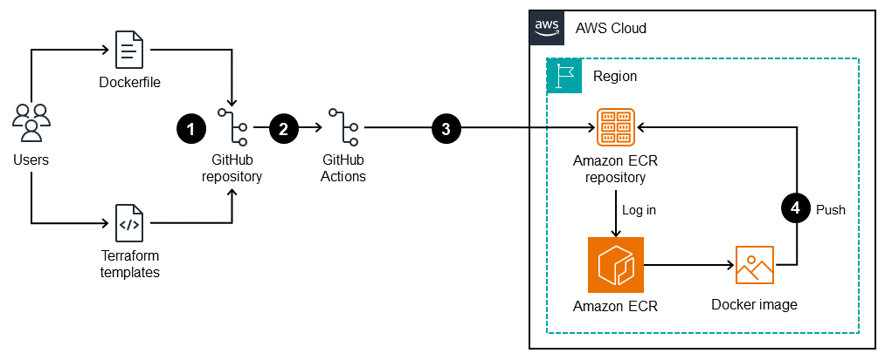
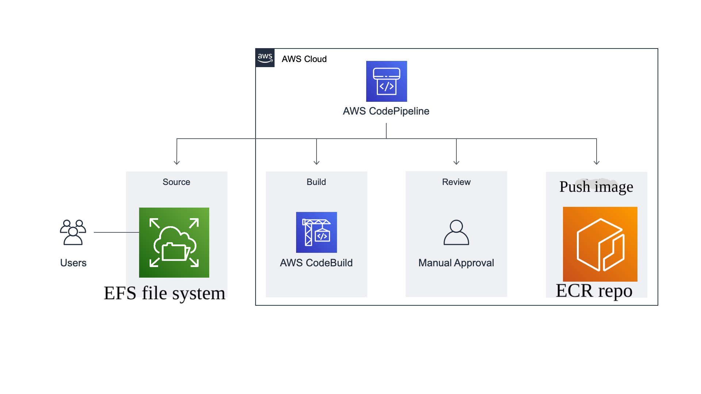
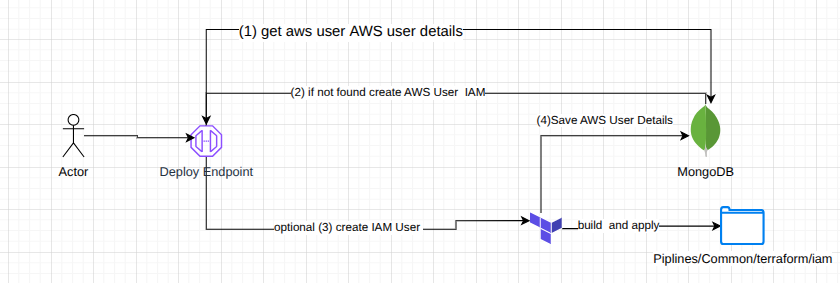
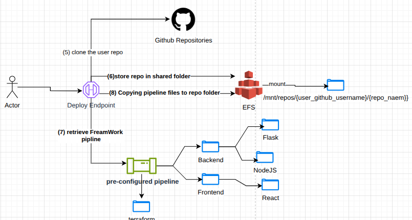
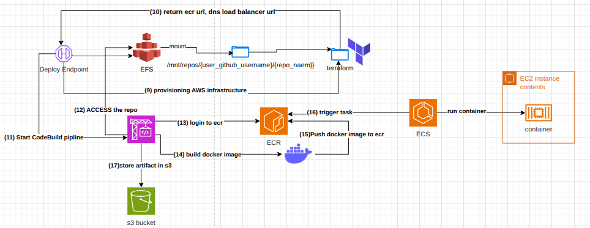
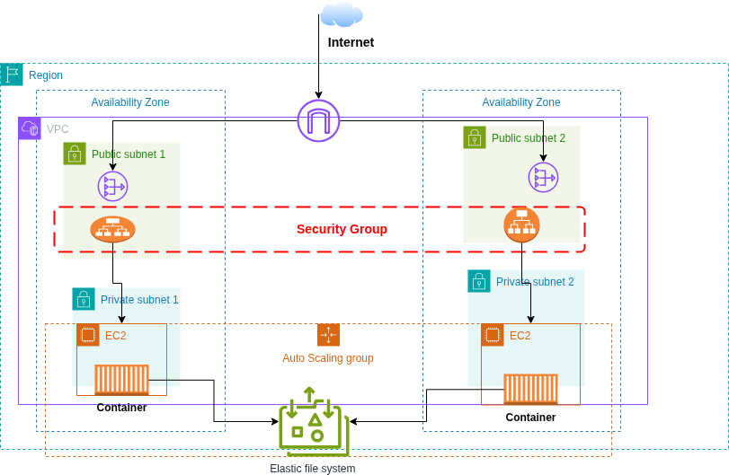
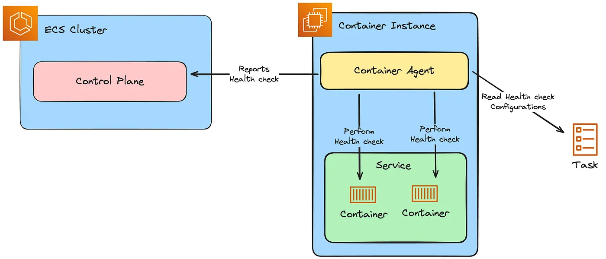
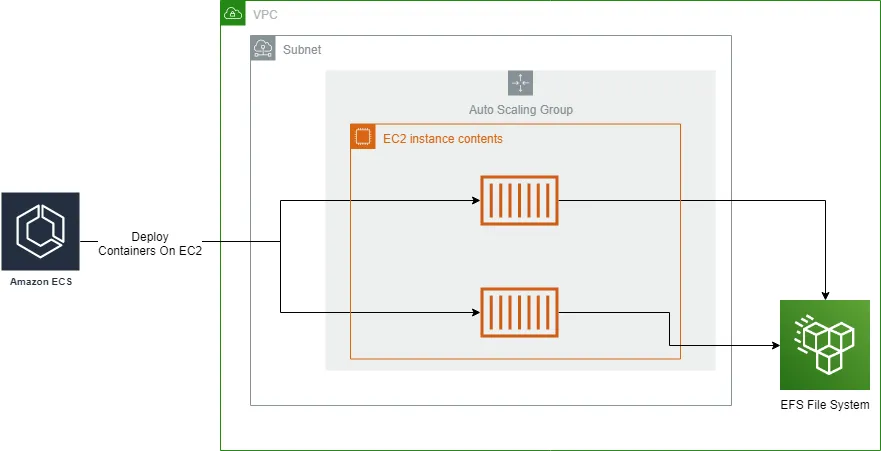
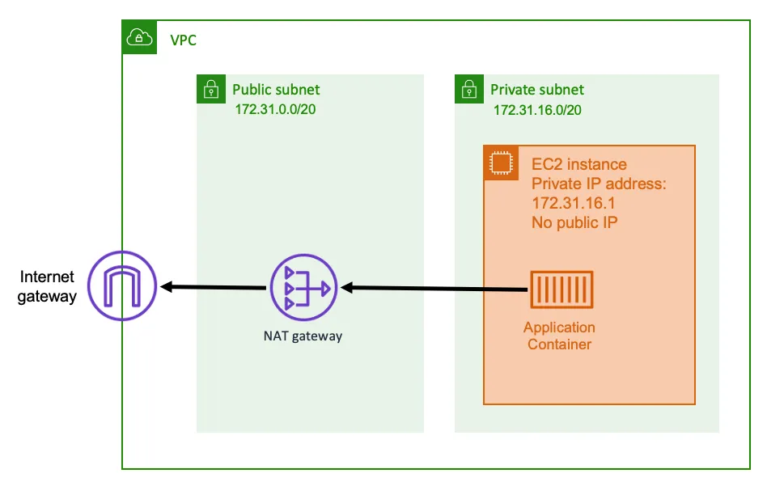
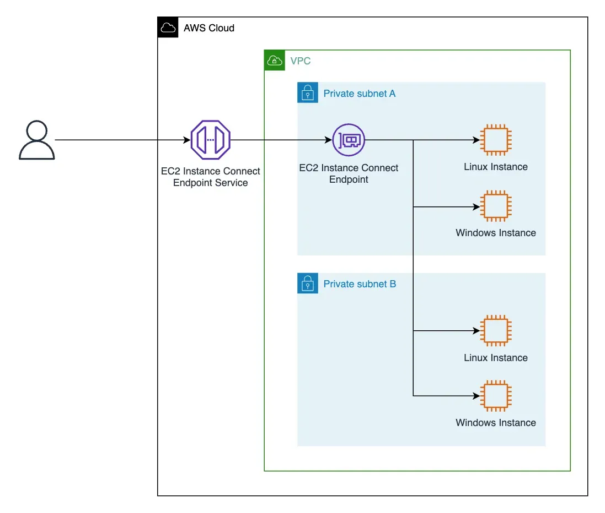

# Easy Deploy Backend

## Overview

Easy Deploy is a SaaS (Software as a Service) platform that simplifies application deployment on AWS, designed for developers who want to focus on building great applications without worrying about DevOps or cloud infrastructure. Our platform handles all the complex AWS setup, containerization, and deployment processes automatically.

Key benefits:
- **Zero DevOps Knowledge Required**: Deploy your applications without understanding AWS, containers, or infrastructure
- **Automated Infrastructure**: We handle all AWS resource provisioning and management
- **Secure by Default**: Built-in security best practices for your applications
- **Scalable Architecture**: Applications automatically scale based on demand
- **Cost-Effective**: Pay only for the resources your application actually uses

## How It Works

### Our CI/CD Pipeline vs Your Application Pipeline

Easy Deploy uses two distinct CI/CD pipelines:

1. **Platform CI/CD Pipeline** (GitHub Actions):
   - Manages the Easy Deploy platform itself
   - Builds and deploys platform updates
   - Handles infrastructure changes
   - Ensures platform reliability and security



2. **Application CI/CD Pipeline** (AWS CodeBuild):
   - Manages your application deployments
   - Builds your application container
   - Pushes to Amazon ECR
   - Deploys to ECS
   - Handles application updates



### Deployment Process

When you deploy an application through Easy Deploy, the following process occurs:

1. **AWS User Setup**:
   - System checks if you have an AWS user account
   - If not, creates a new IAM user with necessary permissions
   - Sets up secure access credentials
   - Configures user-specific AWS resources



2. **Repository Setup**:
   - Clones your GitHub repository
   - Stores it in a secure EFS (Elastic File System) location
   - Copies pre-configured pipeline templates
   - Sets up build and deployment configurations



3. **Application Deployment**:
   - CodeBuild accesses your code from EFS
   - Builds your application container
   - Pushes the image to ECR
   - Deploys the container to ECS
   - Configures load balancing and auto-scaling
   - Stores build artifacts in S3



## Architecture

The system consists of several key components:

1. **ECS Cluster**: A scalable container orchestration service
2. **ECR Repository**: For storing Docker images
3. **CodeBuild Pipeline**: For continuous integration and deployment
4. **VPC with Public/Private Subnets**: For secure networking
5. **Application Load Balancer**: For routing traffic to containers
6. **Auto Scaling Group**: For managing EC2 instances



## Prerequisites

- AWS Account with appropriate permissions
- AWS CLI configured with credentials
- Terraform installed (version >= 1.0.0)
- Docker installed
- Python 3.8+ (for local development)

## Project Structure

```
Backend/
├── app/                    # Application source code
│   └── Pipelines/         # CI/CD and infrastructure code
│       ├── Common/        # Shared infrastructure components
│       │   └── Terraform/ # Terraform configurations
│       └── Backend/       # Backend-specific configurations
├── terraform/             # Root Terraform configurations
├── images/               # Architecture and documentation images
└── env/                 # Environment configurations
```

## Infrastructure Components

### ECS Cluster
The ECS cluster is configured with the following key features:

- **Capacity Providers**: Uses a mix of Fargate and EC2 launch types
  - Fargate for serverless container management
  - EC2 for cost-optimized workloads

- **Task Definitions**: 
  - Defines container specifications
  - CPU and memory requirements
  - Port mappings
  - Environment variables
  - Volume mounts

- **Services**:
  - Maintains desired count of tasks
  - Handles task placement and scheduling
  - Integrates with Application Load Balancer
  - Supports rolling deployments

- **Container Instances**:
  - EC2 instances registered to the cluster
  - Managed by Auto Scaling Group
  - Runs ECS container agent
  - Reports resource availability

- **Monitoring & Logging**:
  - CloudWatch integration for metrics
  - Container insights enabled
  - Centralized logging
  - Health checks and alerts

The cluster uses placement strategies to optimize container distribution across availability zones while maintaining high availability. Task networking is handled through awsvpc mode, giving each task its own ENI and security group.

- Manages container deployments
- Supports auto-scaling
- Integrates with AWS services



### EFS Integration
**Source of Truth**
- Provides persistent storage across all containers and EC2 instances
- Mounted at `/mnt/repos` on EC2 instances and containers
- Automatically scales storage capacity up and down
- Supports concurrent access from multiple availability zones
- Uses NFSv4 protocol for mounting
- Configured with the following:
  - Mount target in each AZ's private subnet
  - Security group allowing NFS traffic (port 2049)
  - IAM roles and policies for ECS tasks
  - Lifecycle policies for backup and retention

Mount Process:
1. EFS mount helper installed on EC2 instances
2. Mount target created in each AZ's subnet
3. EC2 instances mount EFS to `/mnt/repos` at boot time
4. Containers mount EFS via task definition volume configuration
5. All repository data stored under `/mnt/repos/<owner>/<repo-name>`

Benefits:
- Shared storage across all deployment components
- Persistent data survives container restarts
- Automatic backups and high availability
- Elastic scaling without disruption



### Networking
- VPC with public and private subnets
  - Public subnets for internet-facing resources
  - Private subnets for internal resources
  - Custom route tables for each subnet type
  - Internet Gateway for public internet access
  - CIDR block allocation for IP addressing
- Security groups for traffic control
  - Inbound/outbound rules based on ports and protocols
  - Service-specific security groups
  - Default deny-all with explicit allows
  - Stateful packet filtering
- Load Balancer in each public subnet
  - Application Load Balancer (ALB) for HTTP/HTTPS traffic
  - Health checks and target group routing
  - SSL/TLS termination
  - Cross-zone load balancing enabled
- Network ACLs for additional security
  - Subnet-level traffic control
  - Stateless packet filtering
  - Ordered rule evaluation
- VPC Endpoints for AWS services
  - Interface endpoints for ECR, CloudWatch
  - Gateway endpoints for S3, DynamoDB
  - Reduced data transfer costs

#### NAT Gateway
- Enables outbound internet access for resources in private subnets
- Deployed in public subnets with Elastic IP
- Routes traffic from private subnets through public subnets
- Provides security by blocking inbound connections
- Automatically scales based on traffic volume
- Highly available across availability zones


#### EC2 Instance Connect Endpoint
- Secure way to connect to EC2 instances without public IPs
- Eliminates need for bastion hosts
- Uses AWS IAM for authentication and authorization
- Supports SSH and RDP connections
- Traffic stays within VPC network
- Provides audit logs of all connection attempts
- Regional service with automatic scaling


## Deployment Process

### 1. User Onboarding

1. **AWS Account Setup**:
   - System automatically creates an IAM user if needed
   - Configures necessary permissions and policies
   - Sets up secure access credentials
   - Stores user information securely

2. **Repository Integration**:
   - Connect your GitHub repository
   - System clones and stores your code in EFS
   - Sets up build and deployment pipelines
   - Configures environment variables

### 2. Application Deployment

1. **Build Process**:
   - CodeBuild accesses your code from EFS
   - Installs dependencies
   - Builds your application
   - Creates optimized Docker image
   - Pushes to ECR with unique tags

2. **Deployment Process**:
   - Updates ECS task definition
   - Deploys new container version
   - Configures load balancer
   - Sets up auto-scaling
   - Monitors deployment health

3. **Post-Deployment**:
   - Stores build artifacts in S3
   - Updates deployment status
   - Provides deployment URL
   - Sets up monitoring and logging

## CI/CD Pipeline

The system uses AWS CodeBuild for continuous integration and deployment:

1. **Build Phase**:
   - Access source code from EFS
   - Builds Docker image
   - Pushes to ECR

2. **Deploy Phase**:
   - Triggers ECS deployment
   - Updates ECS service with new task definition
   - Updates ECS task definition
   - Deploys new container
   - Updates load balancer


## Security

- IAM roles and policies for least privilege access
- Security groups for network isolation
- ECR image scanning
- VPC with public/private subnet separation

## Monitoring and Maintenance

- CloudWatch integration for logs and metrics
- Auto-scaling based on CPU/memory usage
- Health checks for container instances

## Troubleshooting

### Common Issues

1. **Container Health Checks Failing**
   - Check application logs in CloudWatch
   - Verify security group configurations
   - Ensure correct port mappings

2. **Deployment Failures**
   - Check CodeBuild logs
   - Verify ECR repository access
   - Ensure sufficient IAM permissions

### Accessing Containers

You can connect to running containers using AWS Systems Manager Session Manager:


## Contributing

1. Fork the repository
2. Create a feature branch
3. Commit your changes
4. Push to the branch
5. Create a Pull Request

## Contributors
- [Mohamed Gomaa](https://github.com/mo7amedgom3a)
- [Adel Kazzaz](https://github.com/Adelkazzaz)
## License

This project is licensed under the MIT License - see the LICENSE file for details.
